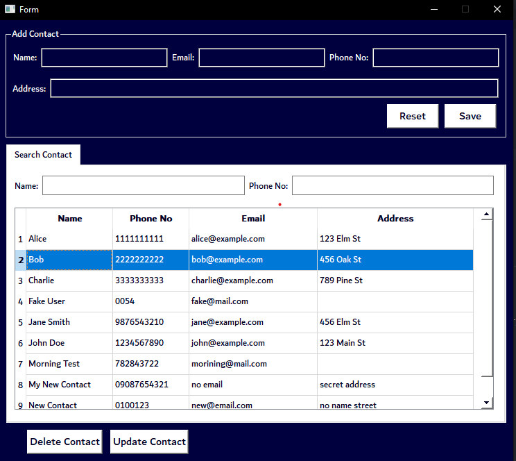
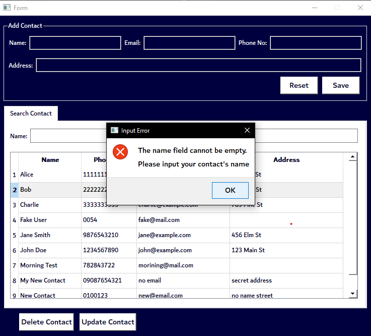
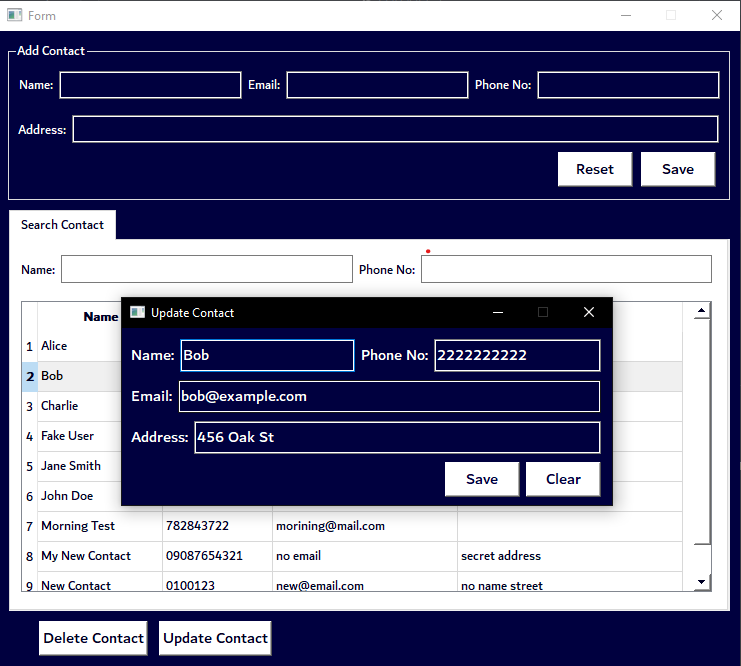

# Contact Manager App

Welcome to the Contact Manager app! This application is designed to help you organize your contacts effortlessly. With a range of features and a user-friendly interface, managing your contacts has never been easier.

## Features

### 1. Contact Information Storage

- Store various details for each contact, including name, phone number, email, and address.

### 2. Add New Contacts

- Effortlessly add new contacts along with their respective details.

### 3. View Contact List

- A comprehensive list of all saved contacts is displayed, making it easy for you to access your contacts at a glance.

### 4. Live Search Functionality

- Implemented a robust live search feature that enables you to quickly find contacts by entering their name or phone number. As you type, the list updates in real-time, showing matching contacts instantly.

### 5. Update Contact Details

- Update contact details as needed to ensure that your information remains accurate and up to date.

### 6. Delete Contacts

- Delete contacts that are no longer needed with just a click of a button.

### 7. User-Friendly Interface

- The app features an intuitive and user-friendly interface, ensuring smooth and hassle-free interaction.

## License

This project is licensed under the MIT License - see the [LICENSE](LICENSE) file for details.

## Acknowledgements

This project was inspired by [CodSoft](https://www.codsoft.in/).

## Contact

For any questions, feedback, or suggestions, please feel free to reach out to [izik adio](https://www.linkedin.com/in/izik-adio/).
